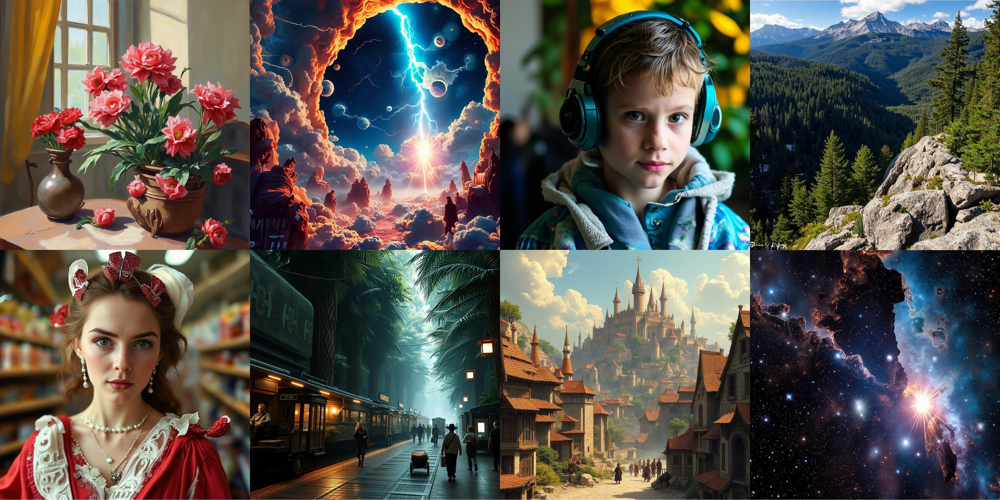

# 
🌟 FluxKits 

We present FluxKits, a repo that facilitate the usage of Flux series models. It consists of the following two parts:

> [**Flux-mini**](./flux-mini/): A 3.2B MMDiT model distilled from Flux-dev.

> [**Flux-NPU**](./flux-npu/): A tool base that helps you to run your flux on NPUs.

Images generated with Flux-Mini:

## 🔥 Flux-Mini

Nowadays, text-to-image (T2I) models are growing stronger but larger, which limits their pratical applicability, especially on consumer-level devices. To bridge this gap, we distilled the **12B** `Flux-dev` model into a **3.2B** `Flux-mini` model, and trying to preserve its strong image generation capabilities. Specifically, we prune the original `Flux-dev` by reducing its depth from `19 + 38` (number of double blocks and single blocks) to `5 + 10`. The pruned model is further tuned with denosing and feature alignment objectives on a curated image-text dataset.

🔥🔥 Nonetheless, with limited computing and data resources, the capability of our Flux-mini is still limited in certain domains. To facilitate the development of flux-based models, we open-sourced the codes to distill Flux in [this folder](./flux-npu/). **We appeal people interested in this project to collaborate together to build a more applicable and powerful text-to-image model!**

### ⏰ Timeline

**[2024.11.25]** We are delighted to release the first version of Flux-Mini!

### ⚡️ Efficiency Comparison
We compared our Flux-Mini with Flux-Dev on `a single H20 GPU` with `BF16` precision, with `batch-size=1`, `deepspeed stage=2`, `gradient_checkpoint=True`. For inference, we adopt `num_steps=50`. The costs of T5, CLIP and VAE are included. `OOM` means out-of-memory.

|  Resolution  | Training Strategy | Model | Training Speed (s/img) | Training Memory (GB) | Inference Speed (s/img) | Inference Memory (GB) |
|-------|------|---------|---------|---------|---------|---------|
| 512 | LoRA(r=16) | Flux-dev | 1.10 | 35.91 | 11.11 | 35.11 |
| 512 | LoRA(r=16) | Flux-Mini | 0.33 | 19.06 | 3.07 | 18.49 | 
| 512 | Fully Finetune | Flux-dev | OOM | OOM | 11.11 | 35.11 | 
| 512 | Fully Finetune | Flux-Mini | 0.57 | 83.7 | 3.07 | 18.49 | 
| 1024 | LoRA(r=16) | Flux-dev | 2.93 | 38.03 | 38.26 | 42.24 |
| 1024 | LoRA(r=16) | Flux-Mini | 1.05 | 22.21 | 10.31 | 25.61 |
| 1024 | Fully Finetune | Flux-dev | OOM | OOM | 38.26 | 42.24 |
| 1024 | Fully Finetune | Flux-Mini | 1.30 | 83.71 | 10.31 | 25.61 |

### ⛅ Limitations
Compared with advanced text-to-image models, our model was trained with limited computing resources and synthetic data with mediocre quality. 
Thus, the generation capability of our model is still limited in certain categories.

The current model is ok with generating common images such as human/animal faces, landscapes, fantasy and abstract scenes.  
Unfortunately, it is still incompetent in many scenarios. Including but not limited to:
* Fine-grained details, such as human and animal structures
* Typography 
* Perspective and Geometric Structure
* Dynamics and Motion
* Commonsense knowledge, e.g., brand logo
* Physical Plausibility
* Cultural Diversity

Since our model is trained with prompts in JourneyDB, we encourage users to apply our model with similar prompt formats (compositions of nouns and adjectives) to achieve the best quality. 
For example: "profile of sad Socrates, full body, high detail, dramatic scene, Epic dynamic action, wide angle, cinematic, hyper-realistic, concept art, warm muted tones as painted by Bernie Wrightson, Frank Frazetta."

We welcome everyone in the community of collaborate and PR for this model.

## 💻 Flux-NPU

The widespread development of NPUs has provided extra device options for model training and inference. To facilitate the usage of flux, We provide a codebase that could run the training and inference code of FLUX on NPUs. 

Please find out more details in [this folder](./flux-npu).   

### ⚡️ Efficiency Comparison on NPU.
We compared our Flux-Mini with Flux-Dev on a single `Ascend 910B NPU` with `BF16` precision, with `batch-size=1`, `deepspeed stage=2`, `gradient_checkpoint=True`. For inference, we adopt `num_steps=50`. The costs of T5, CLIP and VAE are included. `OOM` means out-of-memory.

|  Resolution  | Training Strategy | Model | Training Speed (s/img) | Training Memory (GB) | Inference Speed (s/img) | Inference Memory (GB) |
|-------|------|---------|---------|---------|---------|---------|
| 512 | LoRA(r=16) | Flux-dev | 1.07 | 38.45 | 11.00 | 58.62 |
| 512 | LoRA(r=16) | Flux-Mini | 0.37 | 20.64 | 3.26 | 19.48 | 
| 512 | Fully Finetune | Flux-dev | OOM | OOM | 11.00 | 58.62 | 
| 512 | Fully Finetune | Flux-Mini | OOM | OOM | 3.26 | 19.48 | 
| 1024 | LoRA(r=16) | Flux-dev | 3.01 | 44.69 | OOM | OOM |
| 1024 | LoRA(r=16) | Flux-Mini | 1.06 | 25.84 | 10.60 | 27.76 |
| 1024 | Fully Finetune | Flux-dev | OOM | OOM | OOM | OOM |
| 1024 | Fully Finetune | Flux-Mini | OOM | OOM | 10.60 | 27.76 |

## 🐾 Disclaimer
Users are granted the freedom to create images using our model and tools, but they are expected to comply with local laws and utilize it responsibly. The developers do not assume any responsibility for potential misuse by users.

## 👍 Acknowledgements
We thank the authors of the following repos for their excellent contribution!

- [Flux](https://github.com/black-forest-labs/flux)
- [x-flux](https://github.com/XLabs-AI/x-flux)
- [MLLM-NPU](https://github.com/TencentARC/mllm-npu)

## 🔎 License
Our Flux-mini model weights follows the liscence of [Flux-Dev non-commercial License](https://github.com/black-forest-labs/flux/blob/main/model_licenses/LICENSE-FLUX1-dev).

The other codes follow the Apache-2.0 License.
