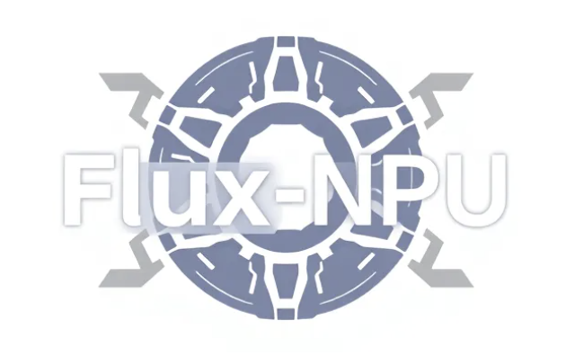

<div align='center'> </div>
<div align='center'>  Flux-NPU: A tool box that helps you to run your flux model on NPUs. </div>

## Environment Setup

- Dependencies & Environment
  - python >= 3.8 (Recommend to use [Anaconda](https://www.anaconda.com/download/#linux))
  - [torch = 2.1.0+cpu](https://pytorch.org/) + [torch-npu = 2.1.0](https://pypi.org/project/torch-npu/2.1.0/)
  - ASCEND NPU (Recommend to use [910B]()) + [CANN](https://www.hiascend.com/en/software/cann)
    - CANN version
    

    ```bash
    > cat /usr/local/Ascend/ascend-toolkit/latest/x86_64-linux/ascend_toolkit_install.info 
    package_name=Ascend-cann-toolkit
    version=8.0.T6
    innerversion=V100R001C17B214
    compatible_version=[V100R001C15,V100R001C18],[V100R001C30],[V100R001C13],[V100R003C11],[V100R001C29],[V100R001C10]
    arch=x86_64
    os=linux
    path=/usr/local/Ascend/ascend-toolkit/8.0.T6/x86_64-linux
    ```

- Installation
  - Clone the repo and install dependent packages
    ```bash
    git clone https://github.com/TencentARC/FluxKits
    cd FluxKits/flux-npu
    pip install -r requirements.txt
    ```


## Usage

### Downloading Weights

To run the code with our Flux-mini, one need to get the following model weights:
* [Flux-mini](https://huggingface.co/TencentARC/flux-mini)
* [Flux-Autoencoder](https://huggingface.co/black-forest-labs/FLUX.1-dev)
* [T5-xxl](https://huggingface.co/google/t5-v1_1-xxl)
* [CLIP](https://huggingface.co/openai/clip-vit-large-patch14)

> The weights of the above model will be automatically downloaded from HuggingFace once you start one of the demos. 

> You may also download the previous weights manually using `python` with  `huggingface_hub`. 
```python
from huggingface_hub import hf_hub_download, snapshot_download
FLUX_MINI_PATH = hf_hub_download(repo_id="TencentARC/flux-mini", filename="flux-mini.safetensors", repo_type="model")
AE_PATH = hf_hub_download(repo_id="black-forest-labs/FLUX.1-schnell", filename="ae.safetensors", repo_type="model")
GOOGLE_PATH = snapshot_download(repo_id='google/t5-v1_1-xxl')
OPENAI_PATH = snapshot_download(repo_id='openai/clip-vit-large-patch14')
```

Set the path of the checkpoints. Replace the `XX_PATH` below with the corresponding values returned above.

```shell
cd FluxKits/flux-mini/src
ln -s GOOGE_PATH .
ln -s OPENAI_PATH .
export FLUX_MINI=FLUX_MINI_PATH
export AE=AE_PATH
```


### Generating images

First, grant write permission to current location for NPU:
```bash
chmod +w .
```


For interactive sampling, run
```python
python -m flux --name <name> --loop
```

Or generate a single sample with
```python
python -m flux --name <name> --height <height> --width <width> --prompt "<prompt>"
```

## Training


### Dataset Preparation
The model could be trained on image-text datasets. The dataset has the following format for the training process:

```text
├── images/
│    ├── 1.png
│    ├── 1.txt
│    ├── 2.png
│    ├── 2.txt
│    ├── ...
```


### Set dataset and model path

#### Dataset Path
Change the path of the dataset in `train_configs/*.yaml`
```
data_config:
  train_batch_size: 1
  num_workers: 1
  img_size: 1024
  img_dir:  /path/to/dataset # your dataset location
```

#### Model Path
```bash
cd FluxKits/flux-npu
ln -s GOOGLE_PATH .
ln -s OPENAI_PATH .
```

### Start Training

Train flux-mini with LoRa on NPU:
```
./scripts/train_lora.sh
```


We also provide codes to run the model distillation:

```
./scripts/train_distill.sh
```
